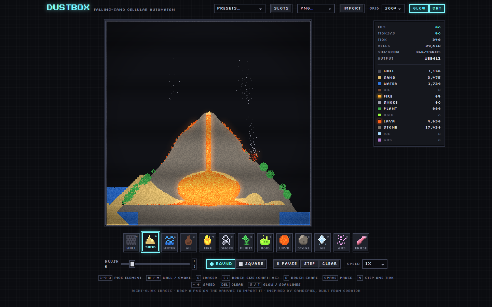
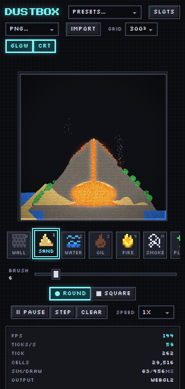

# Dustbox

A falling-sand cellular-automaton playground: paint sand, water, oil, fire, plant, acid, lava and more onto a typed-array grid and watch emergent chemistry unfold at 60 ticks per second.



<details>
<summary>Mobile layout (380px wide): the dock collapses to a horizontal strip under the canvas</summary>



</details>

## Why I built this

Falling-sand games are the friendliest possible introduction to data-oriented design. The whole simulation is a few flat byte arrays and a loop, yet the moment you add a second element the interesting problems show up: how do you stop a grain that just moved from being updated twice in the same pass, how do you keep a left-to-right scan from making every pile lean the same way, how do you make "fire sometimes spreads" reproducible enough to unit test, and how do you push 90,000 cells through JavaScript sixty times a second with time left over to draw them.

I wanted a project where I could answer those questions with measurements rather than folklore, and end up with something that is fun to poke at on a phone. Sandspiel proved the concept; Dustbox is my own take on the rules, the engine and the renderer.

## Features

- **12 elements with distinct behaviour.** Wall, Sand, Water, Oil, Fire, Smoke, Plant, Acid, Lava, Stone, Ice, Gas. Sand sinks through liquids, oil floats and burns, lava creeps and quenches to stone, acid eats through solids and spends itself, ice frosts nearby water a few cells deep, gas pools under ceilings and detonates.
- **Deterministic engine.** One seeded xorshift32 generator drives every random decision. Same seed + same grid = identical bytes 200 ticks later (there is a test for it).
- **Fixed 60 Hz timestep decoupled from rendering**, with a 0.25x-4x speed multiplier, pause and single-step. A 120 Hz display does not make sand fall faster.
- **Pixel renderer with an additive glow pass.** Per-species colour plus per-cell noise, lifetime-driven fire and smoke ramps, liquid shimmer, and a half-resolution box-blurred emissive layer so lava and fire light up their surroundings. Presented through WebGL2 texture upload with a `putImageData` fallback; crisp integer scaling via `image-rendering: pixelated`.
- **Brush tools.** Palette dock with hand-drawn pixel icons, brush size 1-40, round or square, eraser (right-click also erases), clear, and a HUD with FPS, ticks/s, live cell counts and a colour legend.
- **Save and share.** Six named localStorage slots (RLE-compressed), PNG export at 1x/2x/4x via `canvas.toBlob`, PNG import that snaps colours to the nearest element (drop a file on the canvas), and shareable level links carried in the URL hash.
- **Five preset scenes**: Volcano, Rain on Garden, Oil Spill, Acid Bath, Ice Cave, procedurally generated and bundled as RLE strings.
- **Keyboard first.** `1-9 0` pick elements, `[ ]` brush size, `Space` pause, `N` step, `B` shape, `-`/`+` speed, `Del` clear, `G` glow, `T` CRT scanlines. Touch works through pointer events.
- **Grid sizes** 200, 300 (default) and 400.

## How it works

```
                          ┌────────────────────────────────────────────┐
  pointer / hotkeys ───►  │  Engine (src/app/engine.ts)                │
                          │  accumulator: while (acc >= 1000/60/speed) │
                          │     stamp brush  →  world.tick()           │
                          └──────────────────────┬─────────────────────┘
                                                 │ 60 Hz, decoupled from rAF
                                                 ▼
  ┌───────────────────────────────────────────────────────────────────────┐
  │  World (src/sim/world.ts)                                             │
  │  species[] reg[] shade[] clock[]  ─ four flat Uint8Arrays             │
  │                                                                       │
  │  for y = h-1 .. 0:                      (bottom-up: columns fall      │
  │    dir = rng.bool() ? → : ←              as one body per tick)        │
  │    for x in dir:                        (direction re-rolled per      │
  │      if species[i]==0 || clock[i]==parity: skip   row per tick)       │
  │      clock[i] = parity                  (cells that moved into place  │
  │      RULES[species[i]](world, x, y, i)   are not updated twice)       │
  └────────────────────────────────┬──────────────────────────────────────┘
                                   │ rules: density swaps via SINK/RISE tables,
                                   │ probabilistic reactions via seeded Rng
                                   ▼
  ┌───────────────────────────────────────────────────────────────────────┐
  │  renderPixels (src/render/pixels.ts)  →  ImageData.data (RGBA)        │
  │   1. base: LUT[species][shade] + fire/smoke ramps + liquid shimmer    │
  │   2. glow: emissive → ½-res → 2× box blur (prefix sums) → bilinear ⊕ │
  └────────────────────────────────┬──────────────────────────────────────┘
                                   ▼
        Presenter: WebGL2 texSubImage2D + NEAREST quad  |  2D putImageData
                    <canvas style="image-rendering: pixelated">
```

**Memory layout.** Every cell is four bytes spread across four parallel arrays: `species` (what it is), `reg` (a general-purpose register: fire and smoke lifetimes, liquid heading bit, ice frost budget), `shade` (colour noise assigned at birth and carried along on every move so grains keep their grain) and `clock` (the parity of the last tick that touched the cell). Rows are scanned bottom-up so a falling column moves as a unit; the horizontal direction is re-rolled for every row of every tick, which is what removes the left/right bias a fixed scan introduces.

**Rules.** Each species has one rule function `(world, x, y, i) => void` in `src/sim/rules.ts`, joined with colour, density, phase and flammability in the typed `ELEMENTS` table. Movement is decided by 16x16 pairwise tables (`SINK[self][target]`, `RISE[self][target]`) precomputed from phase and density, so "can sand fall into this?" is one byte read. Reactions roll against the seeded generator: `fire` ignites a neighbour with probability `FLAMMABILITY[neighbour]/256` per tick, `acid` corrodes with 72/256, `plant` drinks with 40/256, and so on. Rules pull a single 32-bit word from the RNG and slice it into the several small decisions they need.

**Serialization.** Grids are stored as `DB1;<w>;<h>;<species>[;<reg>[;<shade>]]` where each section is base64 of a byte-pair RLE. Presets ship species only (2-12 KB each); save slots add registers (a busy 300x300 scene is ~17 KB); the shade plane is incompressible noise and is re-rolled on load instead of stored.

## Performance

Measured with `npm run bench` (Node 26, 300x300 grid, 600 ticks per scene, JIT warm-up excluded) on a Windows 11 laptop. The machine was shared with other builds while these were taken; the headline is the best of three runs, the others are single runs and are noisier. On an idle machine every row is 1.5-3x faster than shown.

| Scene (300x300, 600 ticks)             | live cells | total  | per tick | ticks/s |
| -------------------------------------- | ---------: | -----: | -------: | ------: |
| empty grid (scan floor)                |          0 |  67 ms |  0.11 ms |    8982 |
| **Volcano preset (headline)**          |     28,944 | 609 ms |  1.01 ms |     986 |
| Rain on Garden                         |     20,279 | 438 ms |  0.73 ms |    1370 |
| Oil Spill                              |     38,820 | 1.10 s |  1.83 ms |     547 |
| Acid Bath                              |      8,765 | 769 ms |  1.28 ms |     781 |
| Ice Cave                               |     52,194 | 997 ms |  1.66 ms |     602 |
| 30,000 blocked water cells (stress)    |     30,000 | 2.00 s |  3.33 ms |     300 |

Renderer, same machine: base pass 1.2 ms per 300x300 frame, glow pass adds ~2.4 ms (it was ~4.5 ms before moving the blur to half resolution). In the browser the HUD shows the sim taking roughly 60-120 ms of CPU per second at 60 ticks/s on the Volcano scene, leaving the rest of the frame budget for drawing and input.

The acceptance target was "600 ticks of a 300x300 world in under 2 seconds in Node"; the headline scene clears it by a factor of three on a quiet machine and still passed at 928 ms with 58 other Node processes competing for the CPU.

## Run, test, bench

```sh
npm ci
npm run dev          # Vite dev server
npm run build        # tsc -b (strict, zero errors) + vite build
npm test             # vitest: 78 tests across rules, determinism, RLE, palette, storage, renderer, hotkeys
npm run bench        # steps 300x300 worlds for 600 ticks in Node, exits 1 if the headline exceeds 2 s
npm run gen:presets  # regenerate src/sim/presets.data.ts from scripts/gen-presets.ts
npx tsx scripts/preview.ts 240 2   # render every preset to docs/presets/*.png after 240 ticks
```

The tests cover every rule the spec calls out: sand falls exactly one row per tick, water on a flat floor spreads within 50 ticks, oil rests above water after 100 ticks, fire ignites adjacent oil and burns it down to smoke/empty, acid removes a stone cell, lava touching water becomes stone, plant grows into adjacent water, ice freezes adjacent water, plus determinism (same seed, 200 ticks, identical buffers), RLE round trips on random 300x300 grids (property-tested with fast-check), and a purity test that fails if anything under `src/sim/` imports outside the folder or touches a browser global.

## Deploy to Vercel

The app is a static Vite build; `vercel.json` rewrites every path to `index.html`.

```sh
npm i -g vercel
vercel          # follow the prompts; framework preset: Vite, output: dist
```

Or import the repository in the Vercel dashboard and accept the defaults (`npm run build`, output directory `dist`).

## Inspired by

- [Sandspiel](https://sandspiel.club) by Max Bittker. The idea of a small, chemistry-flavoured falling-sand toy with a shared canvas is his; the element rules, simulation engine, renderer and UI here are written from scratch and are not a port.
- The long lineage of falling-sand games (the original Java applet, Powder Toy, Noita's pixel simulation) for the conventions: bottom-up scan, alternating direction, density swaps.

## License

MIT, see [LICENSE](LICENSE). Copyright (c) 2026 Jafn.
